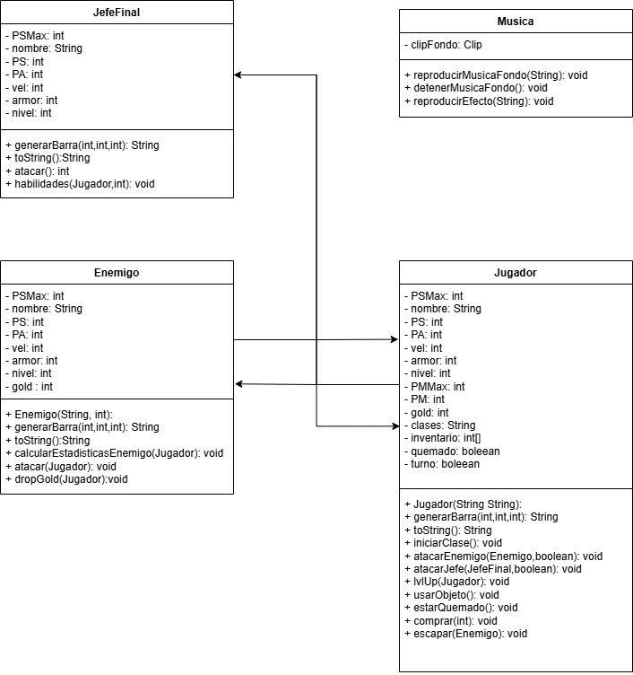
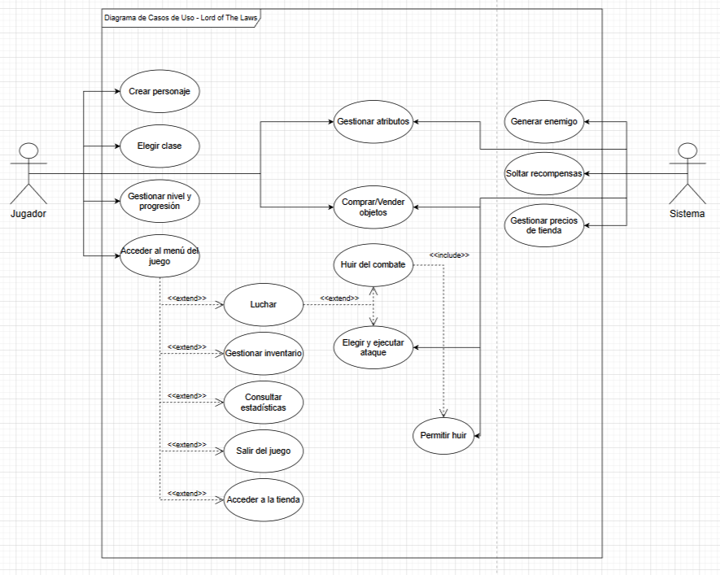
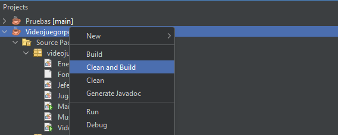
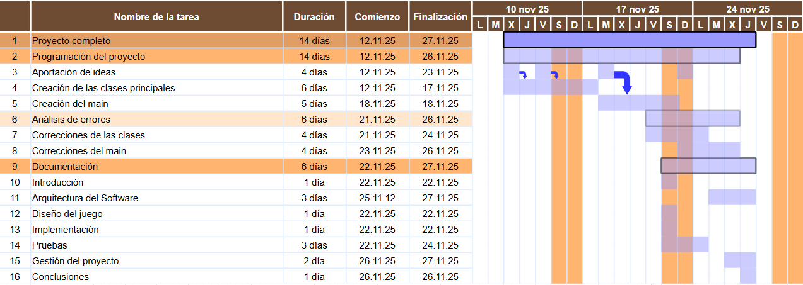

# Documentación del Proyecto - LORD OF THE LAWS

## 1.Introducción

El videojuego se centra en un combate por turnos clásico estilo RPG por turnos pero mucho más simple donde 
el jugador elige clase y se enfrenta a varios enemigos, sube de nivel, compra objetos hasta que se le permite luchar contra el jefe final.

### Objetivos

Desde el principio del proyecto nos habíamos propuesto hacer que el juego fuese por turnos y aunque al principio no teníamos en mente que fuera tan completo, conforme pasaban los días se nos ocurrían más y más ideas,
lo más ambicioso fue cuando se nos ocurrió que todo debería de tener progresión por niveles, además de algunas estadísticas extra como la velocidad o la armadura y también la implementación de música, pero creemos que fuimos bastante realistas a la hora de proponer ideas y luego implementarlas.

## 2. Arquitectura del Software

### Diagrama de clases


### Requisitos Funcionales

**RF-1** Gestión del Jugador

- **RF-1.1** Modificar atributos del jugador(setters)
- **RF-1.2** Consultar atributos del jugador(toString y getters)
- **RF-1.3** Elegir clase
- **RF-1.4** Elegir ataque
- **RF-1.5** Subir de nivel y estadísticas
- **RF-1.6** Utilizar objetos
- **RF-1.7** Huir del combate
- **RF-1.8** Comprar objetos
- **RF-1.9** Crear Jugador


**RF-2** Gestión de Enemigos

- **RF-2.1** Modificar atributos del enemigo(setters)
- **RF-2.2** Consultar atributos del jugador(toString y getters)
- **RF-2.3** Atacar
- **RF-2.4** Elegir ataque
- **RF-2.5** Soltar oro
- **RF-2.6** Generar enemigo
- **RF-2.7** Impedir huir
- **RF-2.8** Subir de nivel


**RF-3** Gestión del menú

- **RF-3.1** Luchar con enemigo
- **RF-3.2** Mostrar estadísticas
- **RF-3.3** Acceder a tienda
- **RF-3.4** Acceder a inventario
- **RF-3.5** Luchar contra jefe
- **RF-3.6** Salir


**RF-4** Gestión de la tienda

- **RF-4.1** Subir precios
- **RF-4.2** Vender objetos
- **RF-4.3** Bajar oro del jugador

### Requisitos no Funcionales

- **RNF-1.1** Tiempos de espera entre acciones para añadir dinamismo
- **RNF-1.2** Música de fondo y para cada interacción
- **RNF-1.3** Visualización de menus cómoda

### Actores y Casos de Uso

**Jugador:** Personaje principal que maneja el usuario.

**Sistema:** Responde a las acciones del jugador, ya sea como enemigo o tienda.

#### Lista de Casos de Uso

| **Nº CU** | **Nombre del Caso de Uso**           | **Actor**         | **Descripción**                                                                               | **Requisitos Funcionales Relacionados** |
| --------- | ------------------------------------ | ----------------- | --------------------------------------------------------------------------------------------- | --------------------------------------- |
| **CU-1**  | Crear personaje                      | Jugador           | El jugador crea un nuevo personaje configurando su nombre                                     | RF-1.9                                  |
| **CU-2**  | Elegir clase del personaje           | Jugador           | El jugador selecciona la clase del personaje, afectando sus atributos.                        | RF-1.3                                  |
| **CU-3**  | Gestionar atributos del personaje    | Sistema / Jugador | Modificar y consultar atributos del jugador y enemigos (vida, ataque, defensa…).              | RF-1.1, RF-1.2, RF-2.1, RF-2.2          |
| **CU-4**  | Gestionar nivel y progresión         | Sistema           | El sistema sube de nivel al jugador y al enemigo y actualiza sus estadísticas.                | RF-1.5, RF-2.8                          |
| **CU-5**  | Elegir y ejecutar ataque             | Jugador / Sistema | El jugador y enemigos seleccionan y ejecutan ataques durante el combate.                      | RF-1.4, RF-2.4, RF-2.3                  |
| **CU-6**  | Luchar                               | Jugador / Sistema | Inicia un combate contra enemigos o jefes, gestionando turnos y resultados.                   | RF-3.1, RF-3.5                          |
| **CU-7**  | Huir del combate                     | Jugador / Sistema | El jugador intenta huir; el sistema puede permitirlo o impedirlo según el enemigo.            | RF-1.7, RF-2.7                          |
| **CU-8**  | Generar enemigo                      | Sistema           | El sistema genera un enemigo con atributos aleatorios.                                        | RF-2.6                                  |
| **CU-9**  | Soltar recompensas                   | Sistema           | El sistema entrega oro u objetos al jugador tras vencer a un enemigo.                         | RF-2.5                                  |
| **CU-10** | Acceder al menú del juego            | Jugador           | El jugador accede al menú: luchar, estadísticas, tienda, inventario y salir.                  | RF-3                                    |
| **CU-11** | Consultar estadísticas del personaje | Jugador           | El jugador visualiza las estadísticas actuales del personaje.                                 | RF-3.2                                  |
| **CU-12** | Gestionar inventario                 | Jugador           | El jugador puede revisar y usar objetos del inventario.                                       | RF-1.6, RF-3.4                          |
| **CU-13** | Acceder a la tienda                  | Jugador           | El jugador entra en la tienda para ver objetos disponibles.                                   | RF-3.3                                  |
| **CU-14** | Gestionar compra y venta de objetos  | Jugador / Sistema | El jugador compra objetos; el sistema vende los objetos al jugador y aumenta sus estadísticas.| RF-1.8, RF-4.2, RF-4.3                  |
| **CU-15** | Gestionar precios de la tienda       | Sistema           | El sistema sube o modifica precios en la tienda.                                              | RF-4.1                                  |
| **CU-16** | Salir del juego                      | Jugador           | El jugador abandona la partida y finaliza el juego.                                           | RF-3.6                                  |


### Diagrama de Casos de Uso




## 3. Diseño del Juego

### Mecánicas del juego

- Escoger una clase: 
		
	- Mago:
		- Ataque especial: Hace daño ignorando armadura
		- Estadísticas: Tiene más maná de base
	- Guerrero: 
		- Ataque especial: Hace dos tiradas de "ataque básico"
		- Estadísticas: Tiene más daño de base
	-  Pícaro:
		- Ataque especial: Multiplica por dos el daño de un "ataque básico"
		- Estadísticas: Tiene más velocidad de base
	- Tanque:
		- Ataque especial: Aumenta su armadura en tres
		- Estadísticas: Tiene más armadura de base
	- Clérigo:
		- Ataque especial: Se regenera vida
		- Estadísticas: Tiene las estadísticas más equilibradas

- Iniciar un combate contra un enemigo

	- Ataca primero el que sea más rápido de los dos, en caso de empate en velocidad sera aleatorio
	- El enemigo te ataca usando ataques básicos
	- Atacar al enemigo
	- Atacar al enemigo con un ataque especial
	- Usar una pociones
	- Huir del combate
	- Cuando luchas contra dos enemigos, subes de nivel y puedes escoger que estadísticas subirte de manera individual
	- El enemigo suelta 

- Mirar las estadísticas del jugador

- Comprar en la tienda:

	- Comprar una espada(sube el daño)
	- Comprar un collar(sube la vida máxima)
	- Comprar una armadura(sube la armadura)
	- Comprar unas botas(sube la velocidad)
	- Comprar un anillo(sube el maná máximo)
	- Comprar una poción de vida(se guarda en el inventario y la puedes usar en combate o desde el menu)
	- Comprar una poción de maná(se guarda en el inventario y la puedes usar en combate o en el menú)
	- Comprar una poción de resistencia al fuego(se guarda en el inventario y la puedes usar en el combate o el menú)
	- Puedes salir de la tienda

- Puedes acceder a tu inventario:

	- Usar poción de vida(recupera vida)
	- Usar poción de maná(recupera maná)
	- Usar poción de resistencia al fuego(elimina el estado quemado del jugador)

- Puedes luchar contra el jefe:

	- El jugador se comporta de la misma manera con el jefe que con un enemigo normal
	- El jefe ataca al jugador con una variación de 4 ataques:
		- "x + 2"Ataque básico	
		- "Tetraedro del fuego" inflige daño al objetivo y tiene la probabilidad de infligir quemadura
		- "Se va pudiendo" el jefe se aumenta su armadura en 3
		- "Sabes lo que es un videojuego, verdad?" inflige poco daño pero hacer que el jugador pierda un turno

- Puedes salir del programa


### Reglas del juego	
	
	
#### Reglas del combate

- En el combate solo se puede realizar una acción por turno, el jugador tiene que elegir entre cuatro opciones mientras que el enemigo solo realiza un ataque básico.
- El jugador solo puede lanzar ataques especiales si tiene maná
- El jugador siempre puede usar un objeto pero si no tiene e intenta usarlo perderá el turno
- El jugador solo tiene garantizada la huida si es más rápido que el enemigo, sino tendrá una probabilidad del 20% de escapar
- El daño realizado se restara respecto a la armadura
- Cuando derrotes a 2 enemigos subirás de nivel
- El jugador no puede subirse más puntos de estadísticas de los que tienes para gastar, estos serán dados de manera aleatoria aumentando con el nivel
- No se puede huir en el combate contra el jefe final 

#### Reglas de la tienda

- El jugador puede comprar cualquier objeto si tiene dinero
- Por cada objeto comprado aumentara la estadística correspondiente y cuantos más objetos del mismo tipo tenga más aumentara la estadística
- El precio de los objetos aumentara según el nivel del jugador


## 4. Implementacion

Hemos usado Java como lenguaje de programación y hemos usado el entorno de NetBeans para programar y gestionar todo el proyecto, dentro del cual la biblioteca más usada ademas de `java.util.Scanner` para introducir datos por teclado, ha sido `java.lang.Math` para poder utilizar e implementar todas las estadísticas tanto del jugador como del enemigo, no hemos hecho uso de nada externo a los conocimientos adquiridos en clase y hemos intentado que ese sea nuestro limitante a la hora de hacer el proyecto, hemos hecho uso de chatGPT en casos excepcionales para generar sobre todo menus más atractivos y amigables con el usuario, todo esto revisado y luego modificado posteriormente para un mejor acabado, solo se ha usado para crear la clase "Musica", ya que es algo que no hemos visto pero nos hacia mucha ilusión implementar, hemos intentado realizar una compresión profunda del código ademas de preguntar al profesorado cualquier tipo de duda asociada a esta clase y su implementación.

Además de las librerías implementadas para el resto de clases, también hemos añadido tres más para la clase "Musica", para poder añadir música, y poder añadir archivos de audio mediante URL:

```java
import javax.sound.sampled.*;
import java.io.IOException;
import java.net.URL;
```


Como recurso externo para el apartado visual hemos usado la siguiente pagina [ASCII Art Archive](https://www.asciiart.eu/) donde hemos sacado to el arte ASCII para los personajes de las clases y algún que otro recurso en particular.

## 5. Pruebas

Durante el desarrollo del programa en su mayoría hemos intentado ser lo más precavidos que hemos podido a la hora de implementar nuestras ideas en el código, intentando anticiparnos a los posibles problemas que podrían ocasionarse en cada uno de los métodos que hemos creado, primero planificamos muy bien nuestras tres clases principales (Jugador, Enemigo, Jefe final) e intentamos definir muy bien que haría cada uno para que luego la implementación del código fuera muchos más sencillo en el main, pero evidentemente no pudimos preverlo todo y hubo bastantes errores, no a nivel de sintaxis o ejecución sino errores lógicos donde el programa compila de manera correcta pero suceden una serie de imprevistos como los siguientes:

### Problemas con la barra de vida

Tuvimos la idea de crear una barra de vida y para ello hicimos un método que calculara los cuadros llenos y vacíos en función de la vida actual del objetivo pero mientras la hacíamos no nos dimos cuenta de que solo habíamos creado el atributo PS que simbolizaba los puntos de salud actuales, al llamar a la función en el toString para utilizarlo nos aparecía que el personaje tenia 25/0 de vida porque ademas al nombrar la atributo ni siquiera la inicializamos al mismo valor que el otro quedando algo asi:

```
JUGADOR: Artemis (Mago)   Nv. 18
HP [----------------] 25/0
 ATK: 25   DEF: 10   VEL: 18   GOLD: 120
```

Por suerte esto tuvo fácil solución simplemente declaramos bien el atributo e hicimos los mismo con el maná.


### El bug de la tienda

Cuando estábamos planificando como hacer la tienda lo que queríamos era que el jugador fuese capaz de comprar objetos y que si compraba varios objetos del mismo fuera aumentando las estadísticas por cada objeto del mismo tipo que compraba.
```
Ejemplo : 1 espada = +1 de daño
		  2 espadas = +2 de daño
```
Con esto se nos ocurrió que los objetos se podrían almacenar en un inventario siendo este un array de enteros que contase cuantos objetos había en cada hueco, como queríamos que fuese un menu hicimos lo siguiente:

```java
 public void comprar(int opcion) {
        switch (opcion) {
            case 1:
                if(gold > 5){
                System.out.println("Compraste una espada");
                PA += inventario[opcion];
                }
                else{
                if (gold > 5) {
                    System.out.println("Compraste una espada");
                    PA += inventario[opcion];
                } else {
                    System.out.println("Te faltan monedas");
                }
                break;
				}
		}
 }
```

Esto evidentemente esta mal por muchos motivos, porque ademas la declaración del atributo inventario tenia de tamaño total 3 debido a que solo habíamos pensado en las pociones en aquel momento, ademas de no responder bien el programa el poner `inventario[opcion]` no tiene ningún sentido según lo habíamos planteado, tras una revisión modificamos el código y la declaración del atributo.

Más tarde en otra prueba nos dimos cuenta de que habíamos introducido la condicional para poder comprar si tenias el oro suficiente, pero no restábamos el dinero por lo que teníamos objetos infinitos, una vez mas se modificó y quedo el resultado final con todo funcionando como debería.

### Experiencia infinita

Otro error muy similar al anterior fue en el método `lvlUP` donde una vez más no restábamos los puntos de experiencia al ser usados, además de no haber condición en caso de no tenerlos.

```java
 public void lvlUP(int opcion){
        int subidaStats = (int) (Math.random() * 6) + PA;

        switch (opcion){
            case 1:
                PSMax+=subidaStats;
                break;
            case 2:
                PMMax+=subidaStats;
                break;
            case 3:
                PA+=subidaStats;
                break;
            case 4:
                armor+=subidaStats;
                break;
            case 5:
                vel+=subidaStats;
                break;
                
            default:
                System.out.println("Esto no es una opcion");
            
        }
```

### Errores de daño y armadura

Hemos tenido bastantes problemas derivados del daño que se le hacia tanto al jugador como al enemigo y con su armadura, entre ellos estaba el hecho de que si alguno de los dos tenia más armadura que daño recibido se curaba, a lo que encima nos dimos cuenta de que el jugador podia curarse por encima de su vida máxima:

```java
 public void atacarEnemigo(Enemigo e1, boolean a1) {
        int PARandom = (int) (Math.random() * 6) + PA;
        int psEnemigo;
        switch (clases) {

            case "Mago":
                if (a1) {
                    System.out.println("Has usado ATAQUE BASICO");
                    psEnemigo = e1.getPS();
                    psEnemigo -= PARandom;
                    e1.setPS(psEnemigo);

                } else {
                    System.out.println("Has usado BOLA DE FUEGO");
                    PM -= 10;

                    psEnemigo = e1.getPS();
                    psEnemigo -= 20 * nivel / 2;
                    e1.setPS(psEnemigo);

                }
                break;
		}
 }
```
Aquí ademas aun no habíamos contemplado la posibilidad de añadir armadura, más tarde se modifico y perfeccionó hasta quedar asi:

```java
public void atacarEnemigo(Enemigo e1, boolean a1) {
        int PARandom = (int) (Math.random() * 6) + PA;
        int psEnemigo = e1.getPS();
        int armorEnemigo = e1.getArmor();
        switch (clases) {

            case "Mago":
                if (a1 || PM < 15) {
                    if (a1 == false) {
                        System.out.println("No tienes suficiente mana");
                    }
                    System.out.println("Has usado MISIL MAGICO BASICO");
                    System.out.println("Has sacado un " + PARandom);
                    if (armorEnemigo < PARandom) {
                        psEnemigo -= PARandom - armorEnemigo;
                        e1.setPS(psEnemigo);
                    } else {
                        e1.setPS(psEnemigo);
                    }

                } else {
                    if (PM >= 15) {
                        System.out.println("Has usado BOLA DE FUEGO");
                        PM -= 15;

                        psEnemigo -= 20 * nivel / 2;
                        e1.setPS(psEnemigo);
                    }
                }
                break;
		}
}
```

Respecto a que la vida del jugador pudiese subir más del máximo nos dimos cuenta de que aquí ya no había problema por ello, ya que al menos por ese bug de daño no iba a ocurrir, donde si podría haber problema era en aquellos lugares donde el jugador se curaba, asi que fue allí donde pusimos dichas condiciones:

```java
if (PM >= 10) {
                        System.out.println("Has usado CURACION");
                        PM -= 10;

                        if (PS + 10 > PSMax) {
                            PS = PSMax;
                        } else {
                            PS += 10;
                        }
                    }
                }
			
```
Aquí en la habilidad especial del clérigo donde se cura o al usar una poción:

```java
switch (objeto) {
            case 1:
                if (inventario[0] > 0) {
                    System.out.println("Te has bebido una pocion de vida \n");
                    if (PS + 10 > PSMax) {
                        PS = PSMax;
                    } else {
                        PS += 10;
                    }
                    inventario[0]--;
                } else {
                    System.out.println("No tienes pociones de vida \n");
                }

                break;
}
```

### Errores simples

Hemos tenido muchísimos errores muy simples de resolver, pero que nos han dado algún que otro dolor de cabeza, por ejemplo si seleccionabas la clase "picaro" y atacabas, el personaje usaba "ataque básico" dos veces y si usabas "ataque especial" lo usaba y ademas hacia un ataque básico, cosa que no tenia ningún sentido porque el resto funcionaba bien hasta que vimos lo que fallaba:

```java
case "Picaro":
                if (a1 || PM < 30) {
                    if (a1 == false) {
                        System.out.println("No tienes suficiente mana");
                    }
                    System.out.println("Has usado ATAQUE BASICO");
                    System.out.println("Has sacado un " + PARandom);
                    if (armorEnemigo < PARandom) {
                        psEnemigo -= PARandom - armorEnemigo;
                        e1.setPS(psEnemigo);
                    } else {
                        e1.setPS(psEnemigo);
                    }

                } else {
                    if (PM >= 30) {
                        System.out.println("Has usado GANG");
                        PM -= 30;

                        System.out.println("Has sacado un " + PARandom + " x 2");
                        if (armorEnemigo < PARandom) {
                            psEnemigo -= (PARandom * 2) - armorEnemigo;
                            e1.setPS(psEnemigo);
                        } else {
                            e1.setPS(psEnemigo);
                        }
                    }
                }
```

Este era el código del picaro al atacar, falta el `break` del final por lo que estaba ejecutando el siguiente ataque básico de la clase de abajo.

Otro error fue casi al final del proyecto cuando hicimos este bucle:

```java
do {
            System.out.println("Introduce tu clase: ");
            numeroClase = teclado.nextInt();
        } while (numeroClase < 0 && numeroClase > 4);
```

Que sin darnos cuenta nunca pasaba por el bucle porque pusimos && en vez de ||, ademas esto hacia que el programa dejase de funcionar porque los números corresponden a una posición del array que contiene los Strings con los nombre de las clases, entonces al tener un tamaño fijo e intentar llamar a una posición que no existía dejaba de funcionar de inmediato.


### Errores con la música

El mayor error y que más tiempo nos ha costado encontrar una solución han sido los relacionados con la música, todo iba bien cuando creamos la clase y probamos a reproducir los archivos pero desde que hicimos un `pull` en github dejo de funcionar y cuando compilábamos veíamos que no encontraba el archivo de audio cuando no lo habíamos movido de carpeta ni nada. Después de muchos días sin saber que pasaba, encontramos la solución, por algún motivo parece ser que los archivos o el propio NetBeans se corrompía y no detectaba bien los archivos cada vez que hacíamos un `pull` y el error se arregló simplemente dándole en vez de a compilar y ejecutar como siempre, dándole a `clean and build` en el proyecto. 



## 6. Gestión del proyecto

La gestión y organización del proyecto viene recogida en este diagrama de Grant:




En el se puede ver que nuestra mayor preocupación ha sido el progreso de programación en si el cual es el que más tiempo nos ha llevado elaborar.
Decidimos empezar directamente a programar después de tener un par de ideas claras porque creímos que seriamos capaces de aplicarlas sin ningún problema ya que al principio no nos propusimos nada demasiado complejo. Conforme pasaron los días se nos iban ocurriendo más ideas y se iba volviendo más complicado, fui ahi cuando aparecieron más errores y una peor organización al no haber planificado con anterioridad como íbamos a gestionar el trabajo.

En general, el trabajo nos ha constado de tres partes para poder organizarlo de una manera rápida, la primera fue la creación de las clases que necesitaríamos para el proyecto, esto lo hicimos de manera individual prácticamente, cada uno se centro en una clase y luego en la segunda parte, la implementación del main, juntamos lo que ambos teníamos y amoldamos para que todo tuviera sentido para poder construir el main. La última parte ha sido la documentación del código y la documentación asociada al proyecto, ya con todo acabado o al menos lo principal, hemos podido centrarnos en sus requisitos funcionales y diversos diagramas.

Gracias a que todo el proyecto lo hemos ido subiendo a github tenemos una clara linea de tiempo de cuando y como hemos modificado y agregado archivos al proyecto, lo que nos ha ayudado mucho a organizarlo todo ya que , además como no hemos seguido una metodología de cascada hemos tenido que volver varias veces a lo anterior para poder corregir o añadir más contenido.

## 7. Conclusiones

Las conclusiones que hemos sacado sobre el proyecto son bastante optimistas, estamos muy contentos y orgullosos de como hemos afrontado el reto de intentar salirnos de lo que se pedía inicialmente para poder explorar nuevas ideas y lo más importante, el cómo implementarlas.

Con esto no queremos decir que nos haya resultado fácil, ha habido varias cosas que han sido un pequeño rompecabezas y nos ha hecho ver lo rápido que algo que ha simple vista puede parecer muy sencillo se puede complicar muy fácilmente para que funcione como esperas, aún así estamos contentos de habernos puesto unos objetivos que sabíamos que podríamos cumplir con más o menos complicaciones, diríamos que el resultado obtenido ha sido bastante más complejo de lo que esperábamos obtener en un principio.

Como mejoras futuras que nos gustaría añadir lo principal seria algún tipo de interfaz gráfica, porque creemos que ha sido uno de nuestros mayores limitantes a la hora de solo poder depender de la terminal para cualquier tipo de interacción, además de eso nos gustaría que el juego fuera más completo, poder añadir algo de historia he incluso un sistema de inventario donde poder tener una equipación que afecte a las estadísticas del jugador, también poder hacer que los enemigos sean distintos entre ellos ya que los que hemos hecho nosotros estaban limitados a usar un solo ataque, nos gustaría hacer que hubiera tipos de enemigos y estos tuvieran otros ataque como el jefe final, para asi también poder hacer que este incluso tenga fases.

Hemos acabado este proyecto cansados, pero muy motivados al ver lo que hemos logrado hacer en un tiempo muy limitado, tenemos muchas ganas de continuar trabajando y poder elaborar otro tipo de proyectos más complejos y así aprender más cosas para poder ser unos profesionales lo mejor formados posibles.
